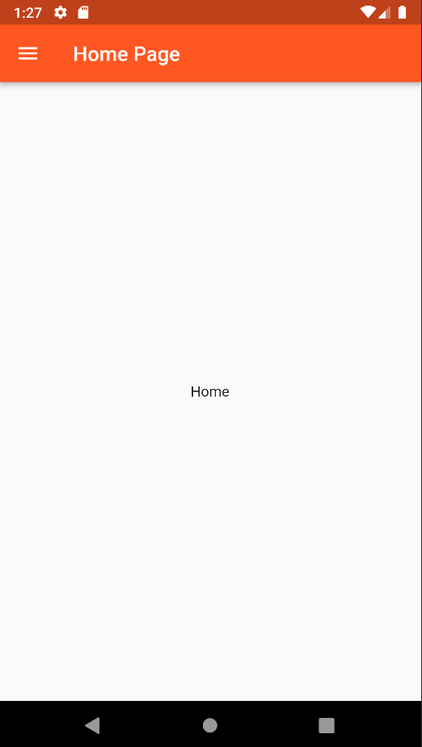
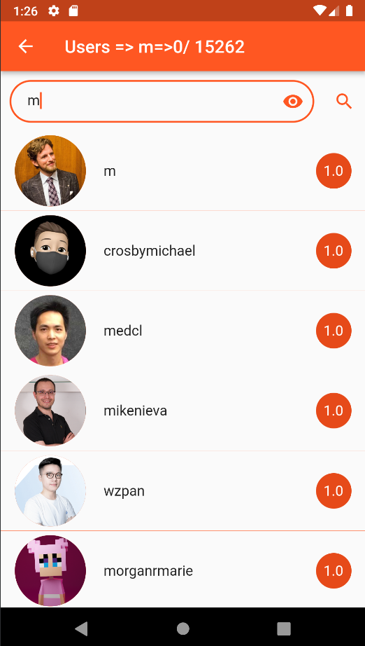

# git_hub_mobile_app

This application it's for calling github API and  appeare them in  the screen as showing in the screens below

## Start the application

for start the application you need just to run this command in your Terminal:
`flutter run`

## Screens
### 1- Home

### 2- List of search

### 3- Repository user

